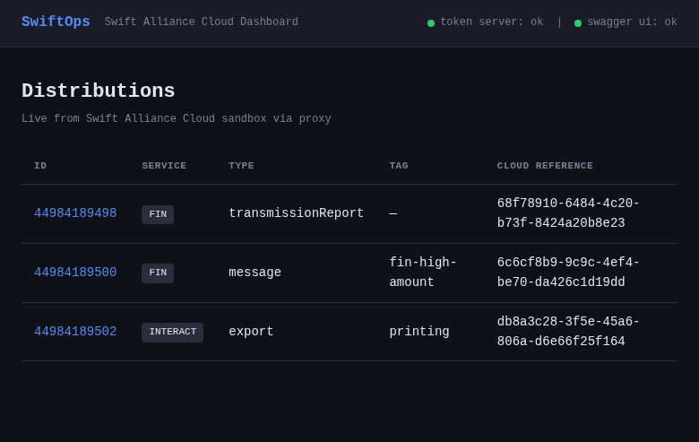
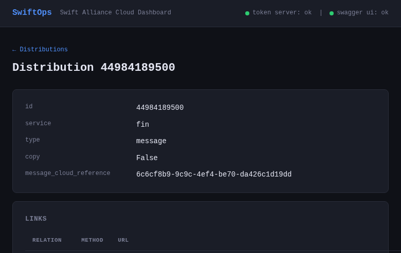

# SwiftOps

**A zero-footprint Swift Alliance Cloud API tooling stack, with a published evaluation methodology for the MCP gateway.**

A personal R&D project (March–May 2026) built on twin goals: ship genuinely useful Swift API tooling *and* a credible technical portfolio for Solutions Architect / API Integration / AI Tooling roles.

> **Status:** Closed out as an open-source portfolio piece (2026-05-18). A successor commercial project sits in agent-to-agent commerce and is in early scoping — not yet public. Full story in [`docs/DEVLOG.md`](docs/DEVLOG.md).

---

## See it work



*The HTMX dashboard at `localhost:84` — live distributions list pulled from the Swift Alliance Cloud sandbox, with token-server and Swagger UI status indicators.*



*Distribution detail view — drill into a single distribution and inspect its routing metadata.*

🎥 **Video walkthrough:** *(coming — covers the dashboard, the MCP gateway in Claude Desktop, and the eval methodology in ~75 seconds. Script: [`docs/demo-video-script.md`](docs/demo-video-script.md))*

---

## What's in the stack

Four containers, all in this orchestration repo's `docker-compose.yml`:

| Repo | Role | Port |
|---|---|---|
| [`swift-token-server`](https://github.com/mblake4u/swift-token-server) | OAuth 2.0 + RFC 7523 JWT-Bearer flow against `sandbox.swift.com`; token caching; `/proxy` route with `X-SWIFT-Signature` injection on mutating requests | 82 |
| [`swift-swagger-ui`](https://github.com/mblake4u/swift-swagger-ui) | Swagger UI with Swift Messaging API v2.1.0 spec baked in | 83 |
| [`swift-ui-client`](https://github.com/mblake4u/swift-ui-client) | FastAPI + HTMX dashboard; live distributions; JSON API at `/api/*` | 84 |
| [`swift-mcp-gateway`](https://github.com/mblake4u/swift-mcp-gateway) | FastMCP server exposing Swift Messaging API as MCP tools; consumable from Claude Desktop / Claude Code / agents. Ships with a [published evaluation methodology](https://www.notion.so/Evaluating-an-MCP-Gateway-A-Methodology-364aa5f988dd8038bb21d34880ca6eab). | 85 |

---

## Quick start

Clone all five repos as siblings, then:

```bash
cd ~/dev/github/mblake4u/swiftops
docker compose up -d
```

Health checks:

```bash
curl http://localhost:82/health                          # token server
curl http://localhost:82/proxy/distributions             # proxy → sandbox
open http://localhost:83                                 # Swagger UI
open http://localhost:84                                 # dashboard
# MCP gateway: configure Claude Desktop at http://localhost:85/mcp
```

Token-server runtime secrets (`.env`, `Sandbox-Certificate.pem`, `Sandbox-Privatekey.pem`) live in the `swift-token-server` directory, not in git. Credentials come from the [Swift Developer Portal](https://developer.swift.com).

---

## The story in five paragraphs

This project went through **two pivots and a closeout** between March and May 2026.

It began (March) as a Swift Microgateway lab with a Python MCP server driving it — a working stack against the Swift sandbox by 2026-03-31.

It **pivoted in April** away from the Microgateway toward a zero-footprint Docker stack that talks directly to sandbox over OAuth + JWT-Bearer. The MGW was over-engineered for the portfolio framing; the agent-facing surface (token server + MCP gateway + UI) was the more interesting story.

It **pivoted again in late April** into a commercialisation direction: an MCP integration layer over BYO data licences, anchored on a small regional bank as design partner, surfaced from a structured 5-paths × multi-entity-structures deep-research pre-flight.

The commercialisation work then surfaced a **larger category** — payments technology in the agent-to-agent commerce space, not Swift-specific — and the right move was to start a successor project for that and close SwiftOps out cleanly as a portfolio + methodology predecessor.

The final shipped artefact is a [published evaluation methodology](https://www.notion.so/Evaluating-an-MCP-Gateway-A-Methodology-364aa5f988dd8038bb21d34880ca6eab) for the MCP gateway — three orthogonal axes (tool-selection accuracy, argument fidelity, operational metrics), 30 hand-curated test cases, multi-model harness with prompt caching, plus a five-cluster failure analysis that surfaced a real product bug fixed in the same session.

Full devlog: **[`docs/DEVLOG.md`](docs/DEVLOG.md)**.

---

## What's worth reading first

If you're a recruiter or fellow engineer dropping in cold, the highest-signal artefacts in order:

1. **[Evaluation methodology (Notion)](https://www.notion.so/Evaluating-an-MCP-Gateway-A-Methodology-364aa5f988dd8038bb21d34880ca6eab)** — the methodology + first baseline + five-cluster analysis, recruiter-legible.
2. **[`docs/DEVLOG.md`](docs/DEVLOG.md)** — full project narrative, both pivots, what carries forward.
3. **[`swift-mcp-gateway/evals/`](https://github.com/mblake4u/swift-mcp-gateway/tree/staging/evals)** — the eval harness + test set + raw results + ADR-003 + the analysis doc with adjusted-number tables.
4. **[`CLAUDE.md`](CLAUDE.md)** — the working context document; three-track structure, closed decisions, ADR pointers.

## Project docs (Notion)

Decisions, deep research, competitive analysis, anchor-customer profile, ADRs — all in [Swift Lab](https://www.notion.so/32caa5f988dd81279a53e570b2e74655) on Notion. Index in [`CLAUDE.md`](CLAUDE.md) → §Project Docs.

## License

Each repo carries its own LICENSE. All open source.
